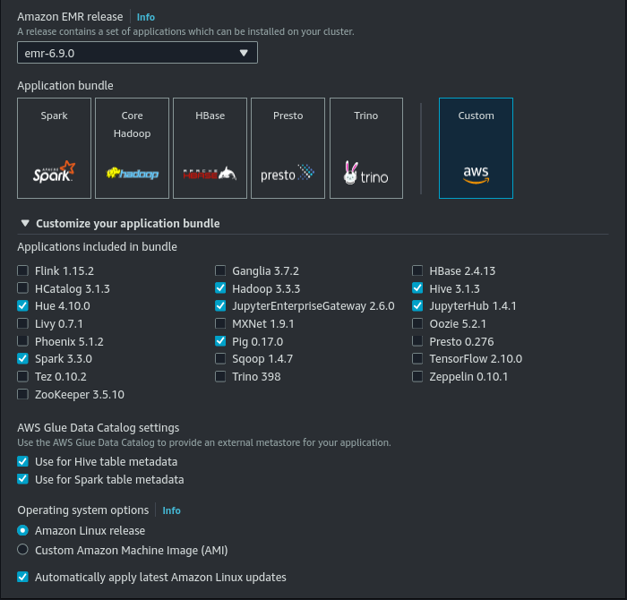
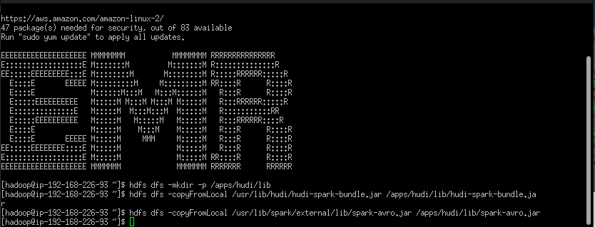

# EMR_1 Code Documentation
Welcome to the iMarckDEV Blog Repository! This repository contains the source code for the [iMarckDEV blog site](https://www.imarck.dev), a platform dedicated to exploring cloud technologies, sharing tutorials, and providing valuable resources for developers.

# Description
In this case, i'll show the use of EMR in a ETL, usin JupiterLab for the notebook and pyspark.

## Especial notes
For this particular case, the entire dataset was provided in a CSV file. This is why a list of file paths is used in this ETL (Extract, Transform, Load) process to read the data. However, there was an issue encountered while reading all the folders due to some data being corrupted or in a different format.

# ETL transoformations
Some curious transformations in this ETL where the date:
```python
date_in='10 de Junio de 2023 18:15:00'
##and how i need
date_out='2023-06-10'
``` 

That's why i've used a USER DEFINED FUNCTION - UDF, called *get_fecha_consulta*.

Some others transformations:
-withColumnRenamed, renamed of fileds
-casting as date:
```python
df = df.withColumn("fecha", lit(datetime.date(int(year), int(month), int(day))))
``` 
-reselect of fileds
-use of repartition and coalesce:
```python
df=df.repartition(100).coalesce(50)
``` 
--In this case, the repartition was set to 100 because there was no reservation of a small portion of the RAM, resulting in the creation of 50 Parquet files with coalescing.

# Some EMR configurations


Some setups  for this use.


The master node in this context refers to the central or primary node in a distributed computing system. It typically acts as a coordinator and is responsible for managing and overseeing the overall execution of tasks in the system. The master node plays a crucial role in task distribution, monitoring, and coordination among the worker nodes.

## Conecting to the master node using Putty or SSH
In this case it's necesary the user@.... to conect at port 22 and the key pair, to send some command at the master node:

```batch
hdfs dfs -mkdir -p /apps/hudi/lib
hdfs dfs -copyFromLocal /usr/lib/hudi/hudi-spark-bundle.jar /apps/hudi/lib/hudi-spark-bundle.jar
hdfs dfs -copyFromLocal /usr/lib/spark/external/lib/spark-avro.jar /apps/hudi/lib/spark-avro.jar
``` 

